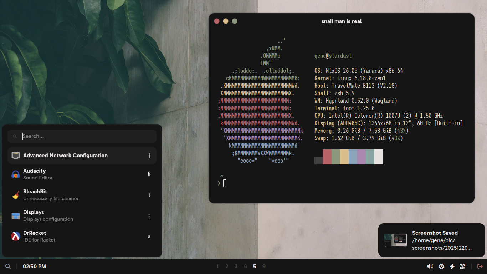
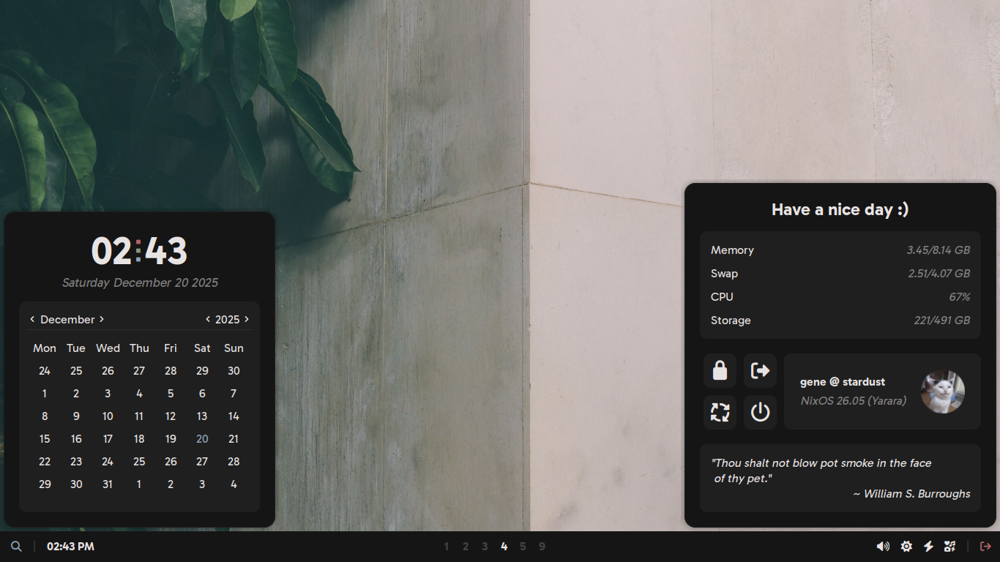
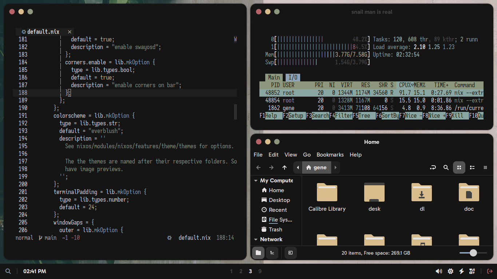

# NixOS

My NixOS desktop configs with home-manager.

## Hosts

- Cyberia: Coreboot ThinkPad T430
- Fluoride: Desktop PC (R5 5600/RX 6600)
- Stardust: Acer TravelMate B113-E netbook

## Rices

### "Interzone"

#### Software

- WM: Hyprland
- Bar: Waybar
- Widgets: EWW
- Launcher: Walker
- Notifications: Mako
- OSD: SwayOSD
- Lockscreen: Hyprlock

#### Screenshots

## Misc Software

- Terminal: Foot/Alacritty/Kitty
- Editor: Neovim
- Browser: Firefox/Zen/Brave/Librewolf
- File manager: Thunar/Yazi
- Shell: Zsh
- Prompt: Starship

## Features

- Consistent theming across Gtk/Qt and pretty much everything else
- Auto-generated theme based on the current stylix base16 colorscheme for everything except icons and cursors
- Ability to easily toggle between desktop colorschemes in config
- Declarative Etterna package/installation (works sometimes)
- [Script](https://github.com/yazoink/nixos/blob/main/modules/home-manager/features/shell-config/scripts/rebuild/rebuild) for rebuilding the system that notifies you when it's done
- [Script](https://github.com/yazoink/nixos/blob/main/modules/home-manager/features/shell-config/scripts/clean/clean) for cleaning the system that notifies you when it's done
- Various other [useful scripts](https://github.com/yazoink/nixos/tree/main/modules/home-manager/features/shell-config/scripts)
- Custom options for easy toggling of features (see [here](https://github.com/yazoink/nixos/tree/main/options/default.nix)).

## Documentation

See [documentation.md](./documentation.md)
