# NixOS

My NixOS desktop configs with home-manager.

## Structure

```
nixos/
|_ default.nix -- general global configs
|_ options/ -- declaration of system config options (set in /hosts/<hostname>/options.nix)
hosts/ -- host configs
|_ <hostname>
|  |_ default.nix -- general host config (i.e. graphics drivers, hostname)
|  |_ hardware-configuration.nix -- generated hardware config
|  |_ options.nix -- system configuration options (declared in /nixos/options)
home-manager/ -- general home-manager config
modules/ -- system modules
|_ home-manager/ -- home-manager modules
|  |_ bundles/ -- bundles of modules that can be toggled in /hosts/<hostname>/options.nix
|  |  |_ <bundle>/
|  |  |  |_ <module>/
|  |  |  |_ <module>/
|  |_ features/ -- misc modules that can be toggled in /hosts/<hostname>/options.nix
|  |  |_ <module>/
|  |  |_ <module>/
|_ nixos/ -- system modules
|  |_ bundles/ -- bundles of modules that can be toggled in /hosts/<hostname>/options.nix
|  |  |_ <bundle>/
|  |  |  |_ <module>/
|  |  |  |_ <module>/
|  |_ features/ -- misc modules that can be toggled in /hosts/<hostname>/options.nix
|  |  |_ <module>/
|  |  |_ <module>/
```

## Rices

### Labwc

("moonfly" colorscheme)

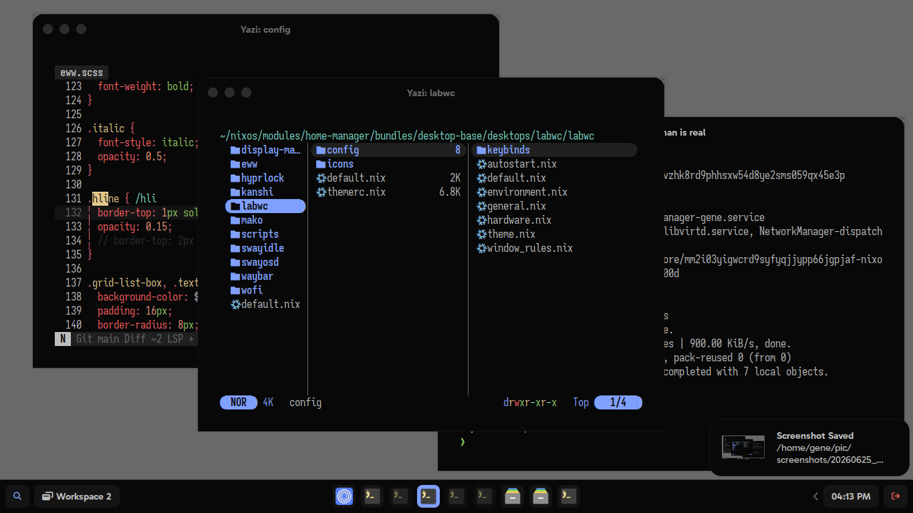
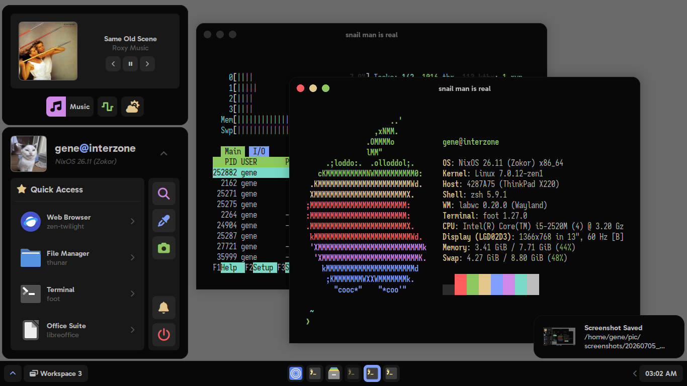
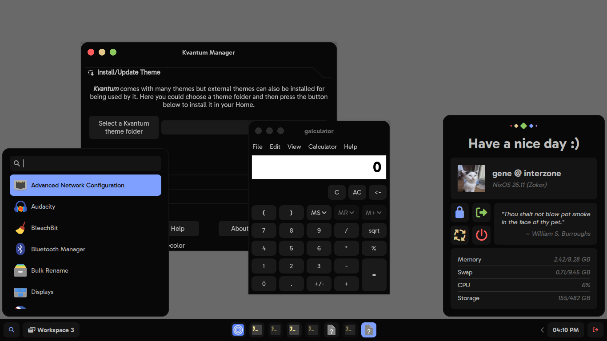

### Labwc "glass"

("rose-pine" colorscheme)

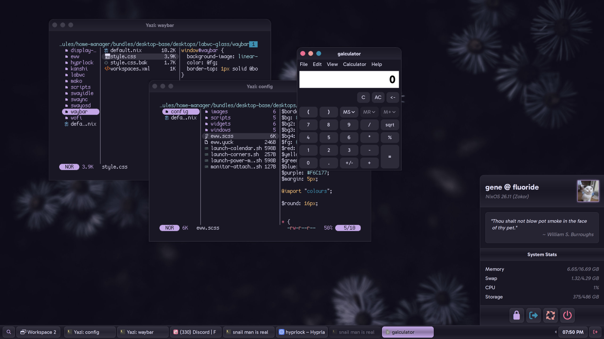
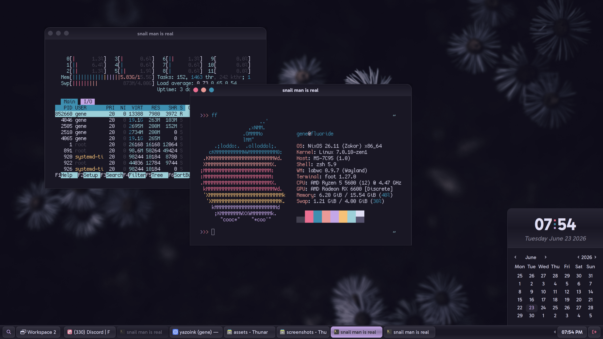
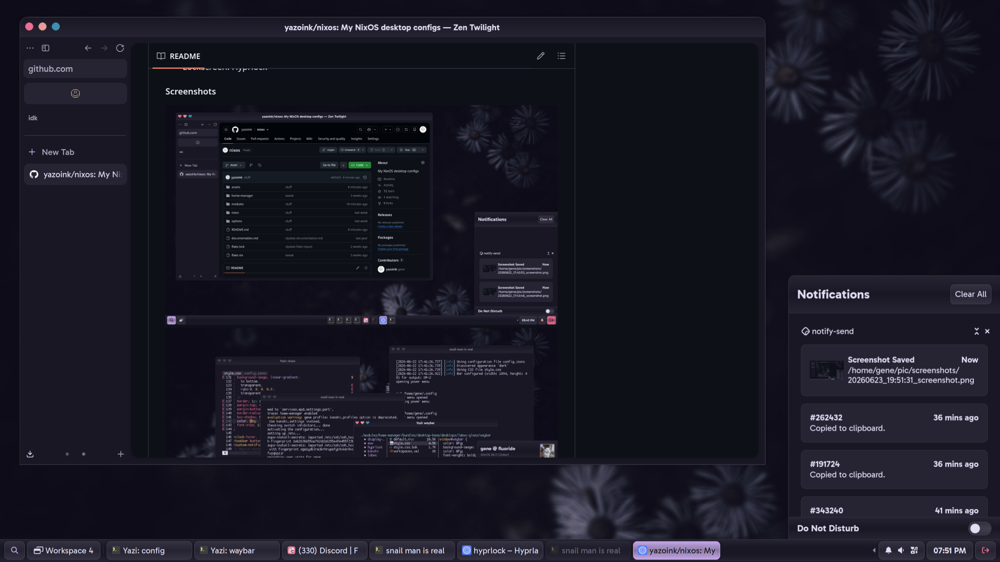

### Hyprland

("paradise" colorscheme)

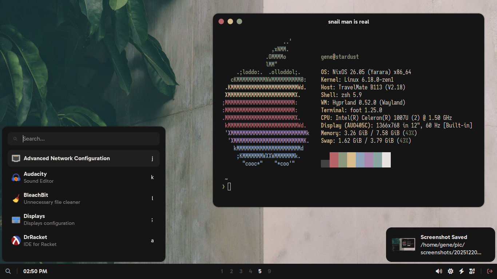
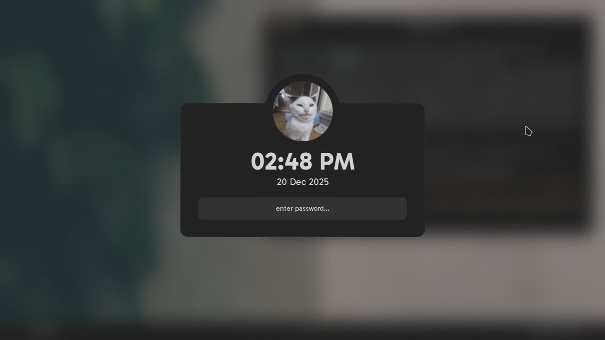
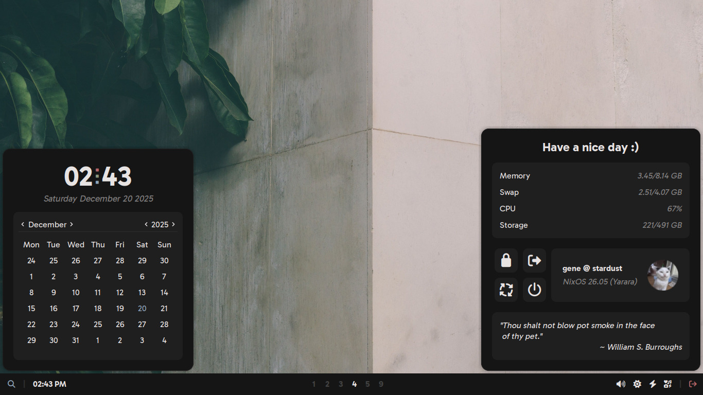
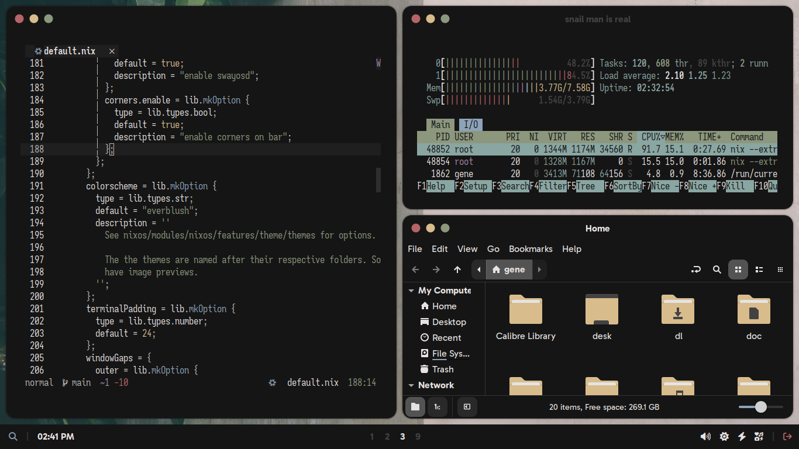
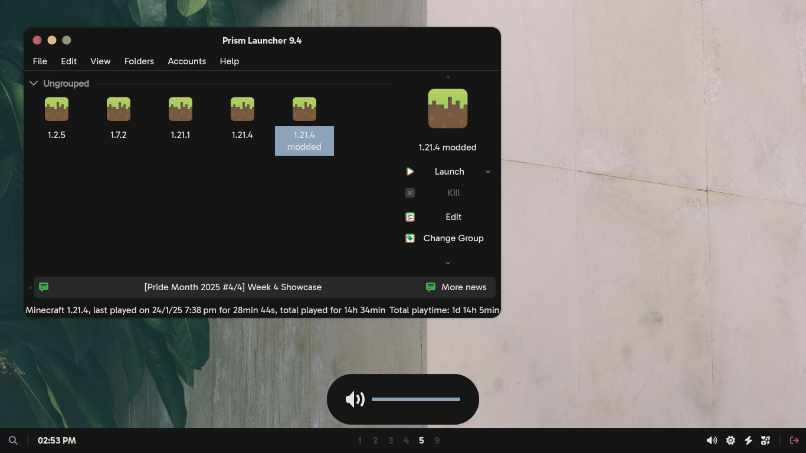

## Features

- Consistent theming across Gtk/Qt and pretty much everything else
- Auto-generated theme based on the current stylix base16 colorscheme for everything except icons and cursors
- Ability to easily toggle between desktop colorschemes in config
- Declarative Etterna package/installation (works sometimes)
- [Script](https://github.com/yazoink/nixos/blob/main/modules/home-manager/features/shell-config/scripts/rebuild/rebuild) for rebuilding the system that notifies you when it's done
- [Script](https://github.com/yazoink/nixos/blob/main/modules/home-manager/features/shell-config/scripts/clean/clean) for cleaning the system that notifies you when it's done
- Various other [useful scripts](https://github.com/yazoink/nixos/tree/main/modules/home-manager/features/shell-config/scripts)
- Custom options for easy toggling of features (see [here](https://github.com/yazoink/nixos/tree/main/options/default.nix)).

## Documentation

See [documentation.md](./documentation.md)
